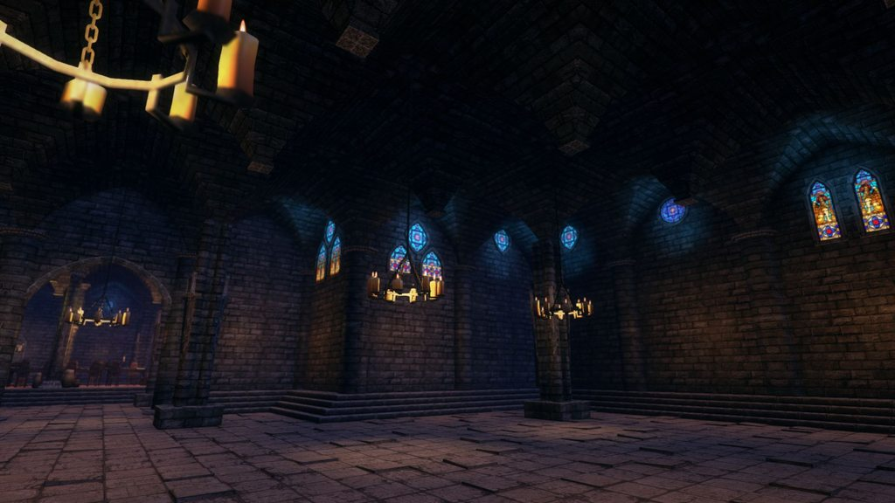

% Dungeon Architect Quick Start Demos
% for Unity

Sample Content
==============
Dungeon Architect comes with sample content to quickly get you started.    It contain free modular assets (Candy) and pre-designed theme files for some of the famous modular assets in the asset store

**Sample content using free assets:**  Already included in DA package under DungeonArchitect_Samples folder

**Sample content using other paid assets in the Asset Store:**  [DOWNLOAD](https://s3-us-west-2.amazonaws.com/coderespawn-public/dungeon_architect/unity/third_party_samples/1.6.0/DungeonArchitect_Samples_Thridparty_v1.6.0.zip)

Candy Theme
===========
Dungeon Architect ships with a set of free modular assets to help you get started.   

Explore the contents under `DungeonArchitect_Samples/Theme_Candy/`

The theme file used to generate the level is located here:

`DungeonArchitect_Samples/Theme_Candy/Themes/CandyDungeonTheme.asset`

Design Time Generation
----------------------
This scene has a dungeon actor setup with the Candy theme.

Select the DungeonGrid actor and click "Build Dungeon" button.  Change the **Seed** variable in the configuration to get a different layout

Scene Location: `DungeonArchitect_Samples/Theme_Candy/Scenes/DemoScene`

\newpage

Runtime Generation
------------------

This demo shows how you can build a new layout at runtime.  Play the scene and use the following controls

* **Space**: Build a new dungeon layout
* **Right Mouse**: Look Around
* **WASD**: Move the camera

Scene Location: `DungeonArchitect_Samples/Demo_Theme_Candy/Scenes/*`

\newpage

Outdoor Cliff Theme
===================

This demo showcases an outdoor scene using free assets by [Kenny](http://opengameart.org/content/3d-nature-pack) 

The art is licensed under CC0 so it can be used with your commercial games

YOUTUBE(jilMwhXIydA)

Cliffs
------
Scene Location: `DungeonArchitect_Samples/Demo_Theme_OutdoorCliffs/Scenes/Demo_OutdoorCliffs`

Alternate Version
-----------------
An alternate version of the theme 
Scene Location: `DungeonArchitect_Samples/Demo_Theme_OutdoorCliffs/Scenes/Demo_OutdoorCliffs_Alternate`

\newpage

Simple City Builder Demo
========================
This example shows how you can build your own layout algorithms and swap the existing one out.    A simple city layout is made in a grid based pattern and various theme files are used to decorate it 

Explore the contents under `DungeonArchitect_Samples/DemoBuilder_SimpleCity/`

The Sample Builder code resides under `DungeonArchitect/Scripts/Builder/SimpleCity`

City Theme #1
-------------
Scene Location: `DungeonArchitect_Samples/DemoBuilder_SimpleCity/Scenes/SimpleCityRealtimeScene`

City Theme #2
-------------
Scene Location: `DungeonArchitect_Samples/DemoBuilder_SimpleCity/Scenes/SimpleCityScene`

Stronghold Theme #1
-------------------
A marker emitter is attached to the builder to extend it by emitting wall markers around the city bounds.   This lets the theme files deocrate the level as a medieval stronghold

Scene Location: `DungeonArchitect_Samples/DemoBuilder_SimpleCity/Scenes/StrongholdBasic`

Stronghold Theme #2
-------------------
An alternative version of the above theme

Scene Location: `DungeonArchitect_Samples/DemoBuilder_SimpleCity/Scenes/StrongholdMedieval`

The art assets is licensed under CC0 and can be used with commercial games

\newpage

MOBA Theme (MK4)
================
A theme created using ManufacturaK4's excellent [Tower Defense and MOBA](https://www.assetstore.unity3d.com/en/#!/content/28234) asset pack

* Import the [Tower Defense and MOBA](https://www.assetstore.unity3d.com/en/#!/content/28234) asset pack into your project before opening the demo scenes
* [Download](#sample-content) the theme files from here and extract it into your project's Asset folder
* Explore the contents under `DungeonArchitect_Samples_Thridparty/Demos/Theme_K4_Moba/`

Summer Mode
-----------

Scene Location: `DungeonArchitect_Samples_Thridparty/Demos/Theme_K4_Moba/Scenes/Demo_MOBA_DA_Summer`

Winter Mode
-----------
The assets come with winter textures as well (however it doesn't come with winter materials and an easy way to switch between the two).  With DA you can do that easily

Scene Location: `DungeonArchitect_Samples_Thridparty/Demos/Theme_K4_Moba/Scenes/Demo_MOBA_DA_Winter`

After the scene is generated,  a dungeon listener script automatically fires that replaces the summer materials with winter ones.  This script is reusable on your other projects

\newpage

Graveyard Theme (ManufacturaK4)
================
A theme created using the city builder and ManufacturaK4's excellent [Top-Down Graveyard](https://www.assetstore.unity3d.com/en/#!/content/25356) asset pack

YOUTUBE(CJLk6VsFxfY)

* Import the [Top-Down Graveyard](https://www.assetstore.unity3d.com/en/#!/content/25356) asset pack into your project
* [Download](#sample-content) the theme files from here and extract it into your project's Asset folder
* Explore the contents under `DungeonArchitect_Samples_Thridparty/Demos/Theme_K4_Graveyard/`

Desert Theme (ManufacturaK4)
================
A theme created using the city builder and ManufacturaK4's [Top-Down Desert](https://www.assetstore.unity3d.com/en/#!/content/44757) asset pack

YOUTUBE(s15dYrR213M)

* Import the [Top-Down Desert](https://www.assetstore.unity3d.com/en/#!/content/44757) asset pack into your project
* [Download](#sample-content) the theme files from here and extract it into your project's Asset folder
* Explore the contents under `DungeonArchitect_Samples_Thridparty/Demos/Theme_K4_Desert/`

Cartoon Town Theme (ManufacturaK4)
================
A theme created using the city builder and ManufacturaK4's [Cartoon Town and Farm](https://www.assetstore.unity3d.com/en/#!/content/17254) asset pack

YOUTUBE(NlqHnM1KG0g)

* Import the [Cartoon Town and Farm](https://www.assetstore.unity3d.com/en/#!/content/17254) asset pack into your project
* [Download](#sample-content) the theme files from here and extract it into your project's Asset folder
* Explore the contents under `DungeonArchitect_Samples_Thridparty/Demos/Theme_K4_CartoonTown/`

Village Interiors (3DForge)
================
A theme created using 3DForge's awesome [Village Interior Kit](https://www.assetstore.unity3d.com/en/#!/content/17033) asset pack

YOUTUBE(-XEp_8kI-Us)

* Import the [Village Interior Kit](https://www.assetstore.unity3d.com/en/#!/content/17033) asset pack into your project before opening the demo scenes
* [Download](#sample-content) the theme files from here and extract it into your project's Asset folder
* Explore the contents under `DungeonArchitect_Samples_Thridparty/Demos/Theme_3DF_VillageInterior/`

\newpage

Village Exteriors (3DF) and Gaia (Adam)
====================================================
A theme created using 3DForge's awesome [Village Exterior Kit](https://www.assetstore.unity3d.com/en/#!/content/38045) asset pack and placed on a terrain generated using Adam's beautiful [Gaia](https://www.assetstore.unity3d.com/en/#!/content/42618) terrain generator

* Import the [Village Exterior Kit](https://www.assetstore.unity3d.com/en/#!/content/38045) asset pack into your project before opening the demo scenes
* Import [Gaia](https://www.assetstore.unity3d.com/en/#!/content/42618) asset pack into your project before opening the demo scenes
* [Download](#sample-content) the theme files from here and extract it into your project's Asset folder
* Explore the contents under `DungeonArchitect_Samples_Thridparty/Demos/Theme_3DF_VillageExterior_Gaia/`

Simple Village Theme
--------------------

YOUTUBE(Dcbqy_tlIHA)

A village theme created using the default grid builder. The theme file places random houses near the layout of the dungeon, making it look like a small village

Scene Location `DungeonArchitect_Samples_Thridparty/Demos/Theme_3DF_VillageExterior_Gaia/Scenes/SmallVillage`

Farm House Theme
-----------------

A grid dungeon with a house placed inside each room of the dungoen.   This makes the indivial houses connected with pathways

Scene Location `DungeonArchitect_Samples_Thridparty/Demos/Theme_3DF_VillageExterior_Gaia/Scenes/FarmHouse`

Stronghold Theme
----------------
YOUTUBE(CoT-e_cX5Rc)

This demo uses the city dungeon builder and a village with walls

Scene Location `DungeonArchitect_Samples_Thridparty/Demos/Theme_3DF_VillageExterior_Gaia/Scenes/StrongholdVillage`

Interiors Theme (MK4)
=====================
A theme created using ManufacturaK4's excellent [Top-Down Interiors](https://www.assetstore.unity3d.com/en/#!/content/18139) asset pack

* Import the [Top-Down Interiors](https://www.assetstore.unity3d.com/en/#!/content/18139) asset pack into your project before opening the demo scenes
* [Download](#sample-content) the theme files from here and extract it into your project's Asset folder
* Explore the contents under `DungeonArchitect_Samples_Thridparty/Demos/Theme_K4_Interiors/`

Wooden Theme
------------
Scene Location: `DungeonArchitect_Samples_Thridparty/Demos/Theme_K4_Interiors/Scenes/01_PalaceWood`

\newpage

Stone Theme
-----------
Scene Location: `DungeonArchitect_Samples_Thridparty/Demos/Theme_K4_Interiors/Scenes/02_PalaceStone`

\newpage

Mixed Theme
-----------
Scene Location: `DungeonArchitect_Samples_Thridparty/Demos/Theme_K4_Interiors/Scenes/03_StoneWood_Mixed`

This sample shows how you can mix two different themes using a *Theme Override Volume*

\newpage

TaD Sewer (3DForge)
===================
A theme created using 3DForge's excellent [TaD Sewer Kit](https://www.assetstore.unity3d.com/en/#!/content/12867) asset pack

* Import the [TaD Sewer Kit](https://www.assetstore.unity3d.com/en/#!/content/12867) asset pack into your project before opening the demo scenes
* [Download](#sample-content) the theme files from here and extract it into your project's Asset folder
* Explore the contents under `DungeonArchitect_Samples_Thridparty/Demos/Theme_3DF_TaDSewer/`

\newpage

MultiStory Dungeon (MS)
======================
A theme created using Mana Stations's excellent [Multistory Dungeons](https://www.assetstore.unity3d.com/en/#!/content/33955) asset pack

* Import the [Multistory Dungeons](https://www.assetstore.unity3d.com/en/#!/content/33955) asset pack into your project before opening the demo scenes
* [Download](#sample-content) the theme files from here and extract it into your project's Asset folder
* Explore the contents under `DungeonArchitect_Samples_Thridparty/Demos/Theme_MS_MultistoryDungeon/`

\newpage

TopDown Dungeon (MK4)
======================
A theme created using ManufacturaK4's excellent [Top-Down Dungeons Mobile](https://www.assetstore.unity3d.com/en/#!/content/8000) asset pack

* Import the [Top-Down Dungeons Mobile](https://www.assetstore.unity3d.com/en/#!/content/8000) asset pack into your project before opening the demo scenes
* [Download](#sample-content) the theme files from here and extract it into your project's Asset folder
* Explore the contents under `DungeonArchitect_Samples_Thridparty/Demos/Theme_K4_TopDownDungeons/`

Isaac Builder
=============
This sample demos the new Isaac builder that creates levels like the ones found in Binding of Isaac

The awesome art from Daniel was used for the 2D sprites: [2D Hand Painted - Dungeon Tileset](https://www.assetstore.unity3d.com/en/#!/content/42935)

* Download the samples from [here](https://s3-us-west-2.amazonaws.com/coderespawn-public/dungeon_architect/unity/third_party_samples/1.2.0/DemoBuilder_Isaac_HandPaint.zip)
* Import the asset [2D Hand Painted - Dungeon Tileset](https://www.assetstore.unity3d.com/en/#!/content/42935)

Scene File: `DemoIsaac`

There is also a theme for the grid builder

Scene File: `DemoGrid`

Simple Shapes Theme
===================
Another example of a theme generated using simple basic shapes

Explore the contents under `DungeonArchitect_Samples/Theme_SimpleShapes/`

Scene Location: `DungeonArchitect_Samples/Theme_SimpleShapes/Scenes/BasicShapesDemo`

\newpage
