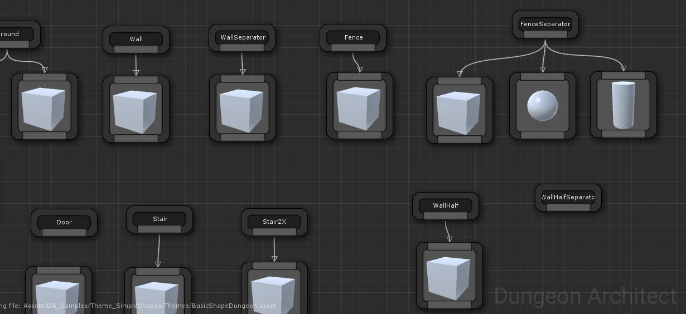

% Dungeon Architect Quick Start Demos
% for Unity 5

Sample Content
==============
Dungeon Architect comes with sample content to quickly get you started.    It contain free modular assets (Candy) and pre-designed theme files for some of the famous modular assets in the asset store

Candy Theme
===========
Dungeon Architect ships with a set of free modular assets to help you get started.   

Explore the contents under `DungeonArchitect_Samples/Theme_Candy/`

The theme file used to generate the level is located here:

`DungeonArchitect_Samples/Theme_Candy/Themes/CandyDungeonTheme.asset`

Design Time Generation
----------------------
This scene has a dungeon actor setup with the Candy theme.

Select the DungeonGrid actor and click "Build Dungeon" button.  Change the **Seed** variable in the configuration to get a different layout

Scene Location: `DungeonArchitect_Samples/Theme_Candy/Scenes/DemoScene`

\newpage

Runtime Generation
------------------

This demo shows how you can build a new layout at runtime.  Play the scene and use the following controls

* **Space**: Build a new dungeon layout
* **Right Mouse**: Look Around
* **WASD**: Move the camera

Scene Location: `DungeonArchitect_Samples/Theme_Candy/Scenes/RuntimeGeneration`

\newpage

Simple Shapes Theme
===================
Another example of a theme generated using simple basic shapes

Explore the contents under `DungeonArchitect_Samples/Theme_SimpleShapes/`

Scene Location: `DungeonArchitect_Samples/Theme_SimpleShapes/Scenes/BasicShapesDemo`

\newpage

MOBA Theme (MK4)
================
A theme created using ManufacturaK4's excellent [Tower Defense and MOBA](https://www.assetstore.unity3d.com/en/#!/content/28234) asset pack
I've designed a few themes around some paid art assets in the asset store.

* Import the [Tower Defense and MOBA](https://www.assetstore.unity3d.com/en/#!/content/28234) asset pack into your project before opening the demo scenes
* [Download](http://coderespawn.github.io/dungeon-architect-quick-start-unity-thridparty/Builds/DungeonArchitect_Samples_Thridparty.zip) the theme files from here and extract it into your project's Asset folder
* Explore the contents under `DungeonArchitect_Samples_Thridparty/Demos/Theme_K4_Moba/`

\newpage

Interiors Theme (MK4)
=====================
A theme created using ManufacturaK4's excellent [Top-Down Interiors](https://www.assetstore.unity3d.com/en/#!/content/18139) asset pack

* Import the [Top-Down Interiors](https://www.assetstore.unity3d.com/en/#!/content/18139) asset pack into your project before opening the demo scenes
* [Download](http://coderespawn.github.io/dungeon-architect-quick-start-unity-thridparty/Builds/DungeonArchitect_Samples_Thridparty.zip) the theme files from here and extract it into your project's Asset folder
* Explore the contents under `DungeonArchitect_Samples_Thridparty/Demos/Theme_K4_Interiors/`

Wooden Theme
------------
Scene Location: `DungeonArchitect_Samples_Thridparty/Demos/Theme_K4_Interiors/Scenes/01_PalaceWood`

\newpage

Stone Theme
-----------
Scene Location: `DungeonArchitect_Samples_Thridparty/Demos/Theme_K4_Interiors/Scenes/02_PalaceStone`

\newpage

Mixed Theme
-----------
Scene Location: `DungeonArchitect_Samples_Thridparty/Demos/Theme_K4_Interiors/Scenes/03_StoneWood_Mixed`

This sample shows how you can mix two different themes using a *Theme Override Volume*

\newpage

TaD Sewer (3DForge)
===================
A theme created using 3DForge's excellent [TaD Sewer Kit](https://www.assetstore.unity3d.com/en/#!/content/12867) asset pack

* Import the [TaD Sewer Kit](https://www.assetstore.unity3d.com/en/#!/content/12867) asset pack into your project before opening the demo scenes
* [Download](http://coderespawn.github.io/dungeon-architect-quick-start-unity-thridparty/Builds/DungeonArchitect_Samples_Thridparty.zip) the theme files from here and extract it into your project's Asset folder
* Explore the contents under `DungeonArchitect_Samples_Thridparty/Demos/Theme_3DF_TaDSewer/`

\newpage

MultiStory Dungeon (MS)
======================
A theme created using Mana Stations's excellent [Multistory Dungeons](https://www.assetstore.unity3d.com/en/#!/content/33955) asset pack

* Import the [Multistory Dungeons](https://www.assetstore.unity3d.com/en/#!/content/33955) asset pack into your project before opening the demo scenes
* [Download](http://coderespawn.github.io/dungeon-architect-quick-start-unity-thridparty/Builds/DungeonArchitect_Samples_Thridparty.zip) the theme files from here and extract it into your project's Asset folder
* Explore the contents under `DungeonArchitect_Samples_Thridparty/Demos/Theme_MS_MultistoryDungeon/`

\newpage

TopDown Dungeon (MK4)
======================
A theme created using ManufacturaK4's excellent [Top-Down Dungeons Mobile](https://www.assetstore.unity3d.com/en/#!/content/8000) asset pack

* Import the [Top-Down Dungeons Mobile](https://www.assetstore.unity3d.com/en/#!/content/8000) asset pack into your project before opening the demo scenes
* [Download](http://coderespawn.github.io/dungeon-architect-quick-start-unity-thridparty/Builds/DungeonArchitect_Samples_Thridparty.zip) the theme files from here and extract it into your project's Asset folder
* Explore the contents under `DungeonArchitect_Samples_Thridparty/Demos/Theme_K4_TopDownDungeons/`

